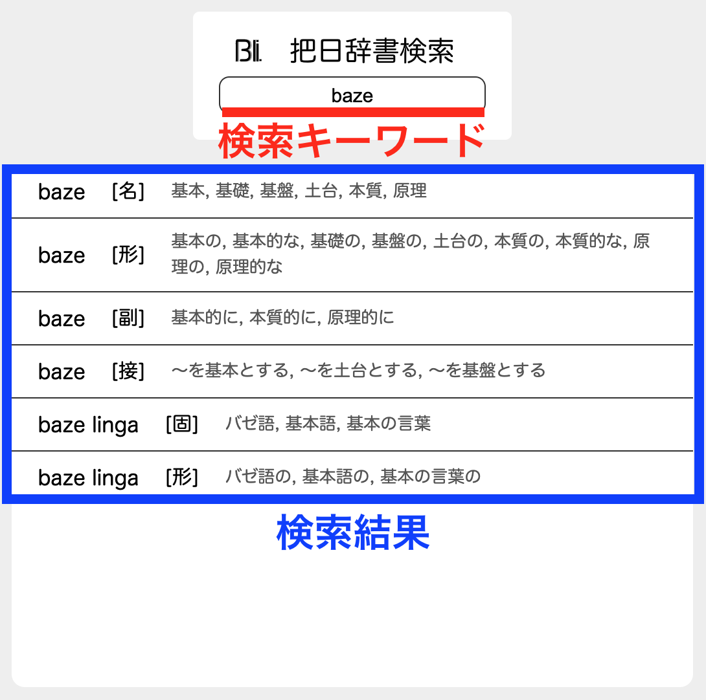
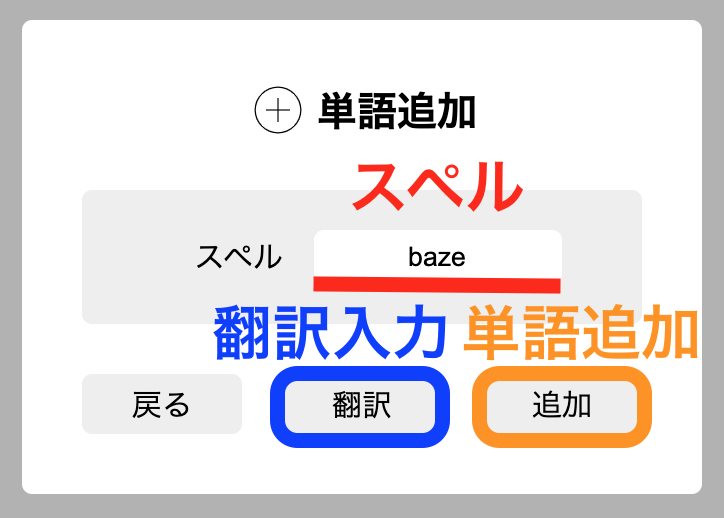
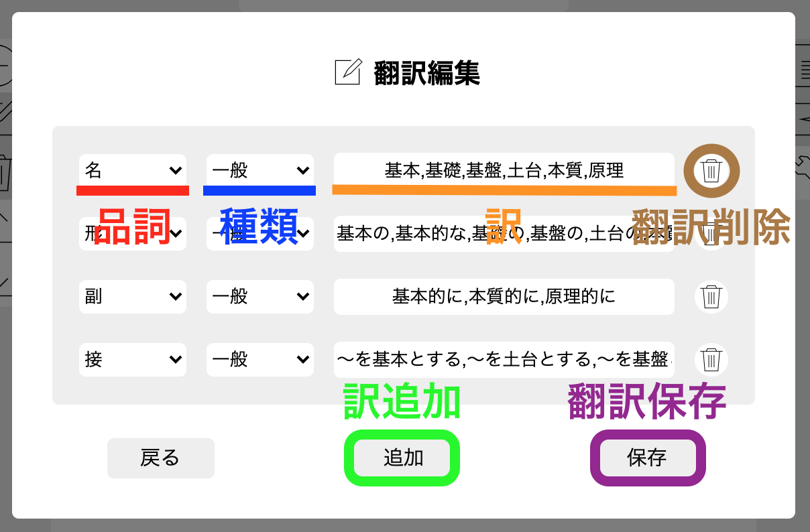
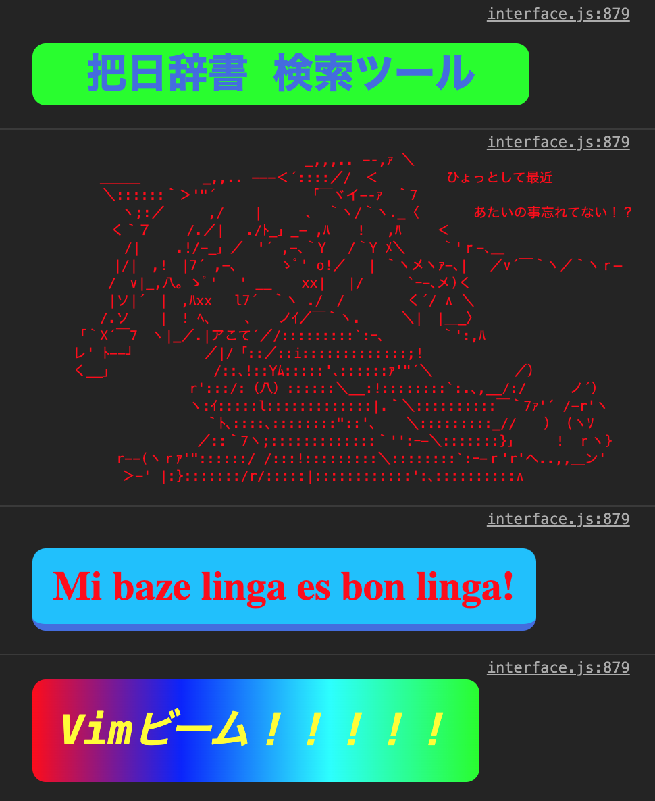

# 使い方

## 操作一覧

辞書を編集してもサーバには保存されません。

ご自由にお使いください。

### 単語を検索する

1. 検索キーワードを入力します

### 検索設定を変更する

単語の表示数などを設定できます。

1. 右サイドメニューのレンチアイコンを選択します
2. 設定を操作します
3. 「OK」ボタンを選択して設定を完了します

### 単語を選択する

選択された単語に対して編集や削除などの操作ができるようになります。

1. 単語一覧からそれぞれの単語をクリックします

### 単語を追加する

1. 左メニューのプラスアイコンを選択します
2. スペルを入力します

3. 「翻訳」ボタンから翻訳入力画面を開きます
4. 右から品詞、種類、訳を入力します(訳はコンマで区切ります)

入力された文字列が無効な場合は入力欄が赤背景になります。

### 単語を編集する

1. 編集したい単語を選択します
2. 左メニューのノートアイコンを選択します
3. [単語を追加する](###単語を追加する) を参考にデータを入力します

### 単語を削除する

1. 削除したい単語を選択します
2. 左メニューのゴミ箱アイコンを選択します
3. 確認ポップアップの「OK」ボタンを選択します

### データをエクスポートする

ページを再読み込みすると辞書データが消えてしまいます。

データをテキスト形式で保存するにはエクスポート機能を使用してください。

1. 左メニューのダウンロードアイコンを選択します
2. [ライセンス](README.md#ライセンス) を必ず確認します
3. 「保存」ボタンを選択します

### データをインポートする

エクスポートしたファイルをあとから読み込むことができます。

※ 保存されていない変更は消えてしまいます。

1. 左メニューのアップロードアイコンを選択します
2. 枠内をクリックするかページ内にファイルをドロップします
3. 確認ポップアップの「OK」ボタンを選択します。

### 単語を共有する

1. 共有したい単語を選択します
2. 右メニューの共有アイコンを選択します
3. 共有方法を選択します
    - 左: クリップボードにURLをコピー
    - 右: Twitterでツイート

### 言語を変更する

単語一覧の下のエリアから以下の表示言語を選ぶことができます。

- バゼ語
- 英語
- エスペラント
- 日本語

## Q&A

### バゼ語とは？

[がーねっと](https://twitter.com/Garnet3106) が制作している [人工言語](https://ja.wikipedia.org/wiki/人工言語) の1つです。

### コンソールのメッセージは何？

お気になさらず。

## トラブルシューティング

### 表示範囲が小さい

ウィンドウを縦に伸ばしてみてください。

### タイトルが「Loading...」のままになっている

辞書データなどの読み込みに失敗しているかもしれません。

よろしければ制作者に [ご連絡](README.md#連絡先) ください。

### 検索結果が表示されない

他のキーワードを試してみてください。

解決しない場合は右メニューの設定にある検索フィルタ設定を確認してみてください。

### 単語が選択されないときがある

修正予定の現象です。

もう1度単語を選択してみてください。

### ファイル選択画面が2度表示される

修正予定の現象です。

もう1度ファイルを選択してみてください。

### 404ページに飛ばされる

各単語のドキュメントはまだ用意ができていません。

時間があれば整備します。

### インポートに失敗する

選択したファイルの形式が正しいか確認してください。

独自の記法のテキストファイルのみを読み込むことができます。
